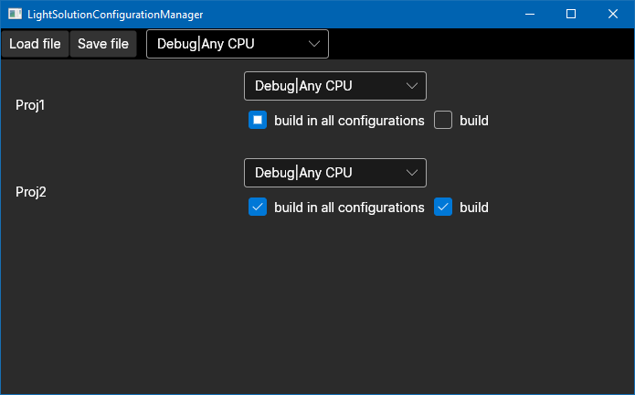

LightSolutionConfigurationManager
=================================

Configuration manager for dotnet solution files (`.sln`).

Issues and PRs are welcome!

Project is written in [F#](https://github.com/dotnet/fsharp/) with UI
provided by [Avalonia.FuncUI](https://github.com/fsprojects/Avalonia.FuncUI)

Why?
----

VisualStudio provides configuration manager to edit individual projects
setting mappings between solution setting (e.g. `Debug|x64`)
and project setting (`Debug|x86, Build: true`) which allows to
disable build for individual projects or to change project configration and
platform.

Problem with builtin manager is that mostly you want to make solution
setting correspond to project setting
(`sln: Debug|x64 proj: Debug|x64` instead of `sln: Debug|x64 proj: Debug|AnyCPU`)
which might be tedious to change because you need to change setting for
every platform (`Any CPU`, `x64`, `x86`, `ARM`) and every configuration
(`Debug`, `Release`, `CustomConf`, `AnotherCustomConf`).
This becomes especially hard when amount of projects grows beyond 50 and
IDE hangs every time configuration or platform is changed.

Features
--------

All features supported by VisualStudio's configuration manager including

* Change project `Configuration|Platform` for every solution `Configuration|Platform`
* Change whether project should be built in given solution `Configuration|Platform`

TODO
----

:heavy_check_mark: **Feature:** Enable/disable build for all solution settings

:large_blue_circle: **Feature:** Make projects `Configuration|Platform` corresponging to
    solutions `Configuration|Platforms`
    
:large_blue_circle: **Feature:** Change folder structure, so projects will be displayed according
      to file system folder structure
      
:large_blue_circle: **Feature:** Move projects to be located same way as in solution explorer

  :large_blue_circle: with git support
  
:large_blue_circle: **UI-design:** Make application look better

:large_blue_circle: **Repo-design:** Contribute changes to MSBuild [issue#1708](https://github.com/dotnet/msbuild/issues/1708)

Build
-----

Everything that's required is just NET5 sdk!
Open `src` folder and type

```bash
dotnet restore
dotnet build
```

Building from solution file is also supported!

Screenshots
-----------


